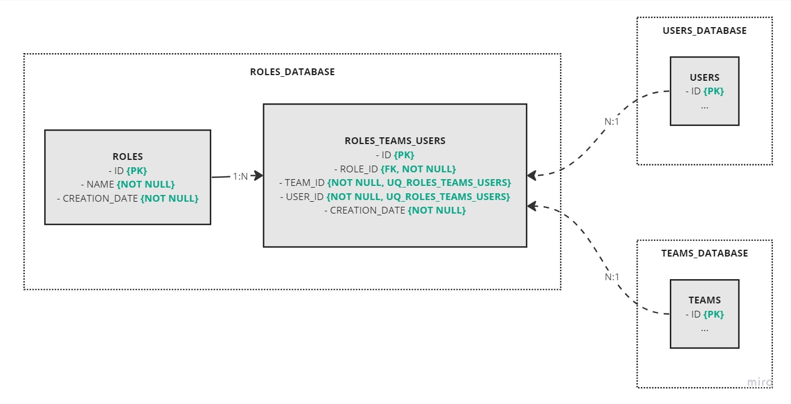
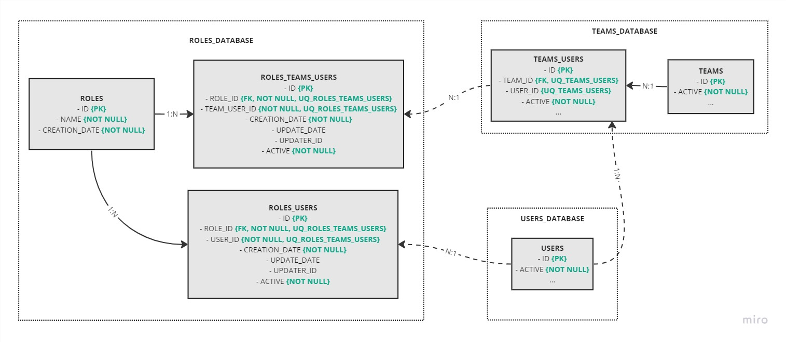
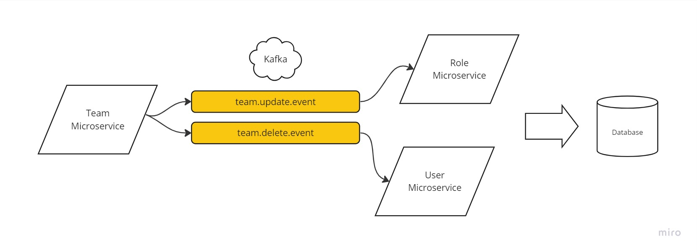

# Roles Microservice

This repository contains the implementation of the Roles service, which enhances the existing Users and Teams services by 
introducing the concept of team roles and associating them with team members. The service allows creating new roles, 
assigning roles to team members, and looking up roles for memberships.

## Problem and Solution

The main task was to create a new Roles service that extends the functionality of the existing Users and Teams services. The service introduces the concept of team roles and allows associating roles with team members.

To approach the problem, I followed these steps:

1. Identified the requirements: The task required implementing a new service to handle team roles and memberships.
2. Defined the role structure: The minimum three pre-defined roles were Developer, Product Owner, and Tester, with Developer as the default role.
3. Designed the REST API: I designed the REST endpoints to create new roles, assign roles to team members, and look up roles for memberships.
4. Implemented the service: I developed the Roles service using Java and Spring Boot.
5. Wrote tests: I created unit tests and REST API tests to ensure the correctness of the service.
6. Added validation and handled edge cases: I implemented the input validation and considered edge cases to make the service robust and reliable.
7. Considered scalability and architecture: I designed the service with scalability in mind, making it suitable for larger applications.

### Database Modeling



## Requirements

- Install Docker
- Install Docker Compose

## How to Run the Code

To run the code, it is just use the Docker Compose to build and run the application container:

```bash
$ docker-compose up
```

> After running the application, you can access the Swagger to see the available endpoints and test the application: http://localhost:8080/swagger-ui/index.html

## Suggestions for Improvements

1. **Synchronize Data on User Deletion**: When a user is deleted, it is recommended to synchronize the information in the Roles service database. This can be achieved by publishing an event (e.g., using Kafka) related to the user deletion. The Roles service can subscribe to this event and update the relevant role memberships accordingly.
2. **Soft Delete for Role Memberships**: Instead of erasing the information from the tables, we can create an "active" flag. It's more interesting to deactivate the role membership or to deactivate the user instead of permanently erasing the information. This allows us to maintain historical data and better handle data integrity.
3. **Include Pagination for Endpoints**: To handle large amounts of data efficiently, it's essential to include pagination for the other endpoints (e.g., Get Users, Get Teams). This ensures that the response size is manageable and reduces the risk of performance issues.
4. **Role-based Access Control**: Only specific roles should be able to access the roles and membership information depending on the solution that we will create. For enhanced security, in the future, we could implement OAuth 2 to handle role-based access control, granting different permissions to different roles.
5. **API Versioning**: To maintain backward compatibility and facilitate future updates, we should include API versioning in the request URL of the Users and Teams services. This way, changes to the API can be made without breaking existing clients.
6. **Client Libraries**: The clients for accessing the Users and Teams services should be developed as libraries. This allows for better code reuse and easier maintenance of the client code.
7. **Generic Queries**: Instead of having a specific endpoints to filter information, we can consider implementing a generic query using pagination and query parameters to filter roles based on membership information. This provides more flexibility and simplifies the API surface.
8. **Artificial ID for Team Membership**: The teams membership table could have an artificial ID, which would better represent the correlation in the table. With this artificial ID, we would not need to validate if the relationship between the User and the Teams exists, as the ID itself serves as a reference.
9. **Team Leader Role**: Considering that each team has one user as a team lead, it would be beneficial to represent the team leader as a role in the role_membership table. This allows us to apply the same role-based functionality to the team leader.
10. **HTTP Status for Not Found**: When the endpoints don't find the specific user or team, it's better to return an HTTP status of 404 (Not Found) instead of 200 (OK). This provides a more accurate and standardized response when the requested resource is not available.

### Database Possible Improvements



In my opinion, this more generic database modelling would be better, because it would make it possible:

- For the users to register more than one role that they can be assigned (creating if necessary the ROLES_USERS table in the future)
- To separate the list of possible roles of a user from the roles that he has in a specific team
- To have users within multiple teams
- To control the person or application that made the role status change for a user or team user by creating the UPDATER_ID field
- To deactivate a user, team user or the roles separately keeping the history of the operations, to make it possible we would need to add the ACTIVE field in the necessary tables as boolean flag

### Information Synchronization Example



In the example when some information is updated or deleted by the Team microservice, it produces events that can be consumed by the Role or User microservices. 
When the microservices consume the events, they can execute the business logic to synchronize the information in their databases. 
